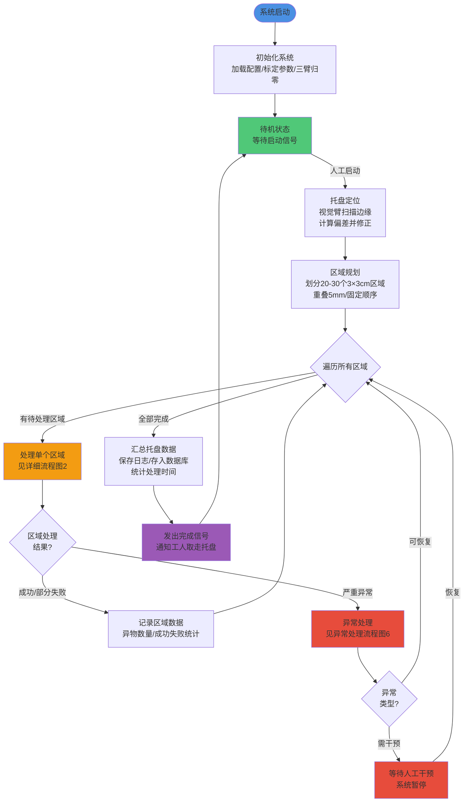
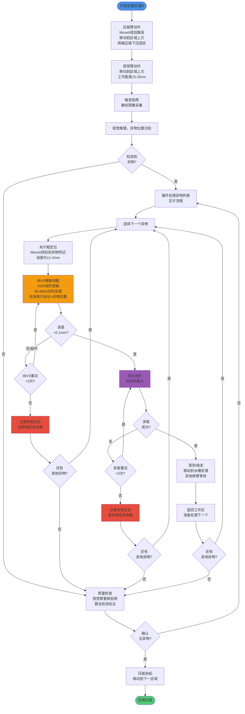
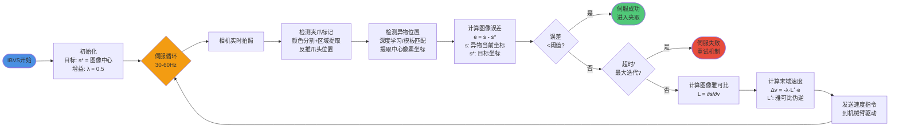
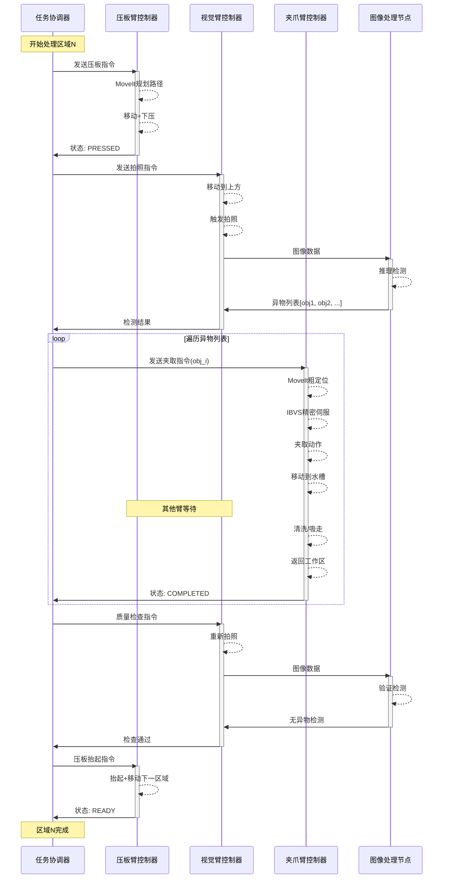
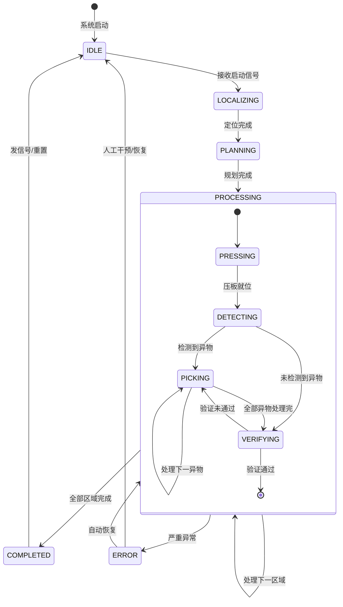
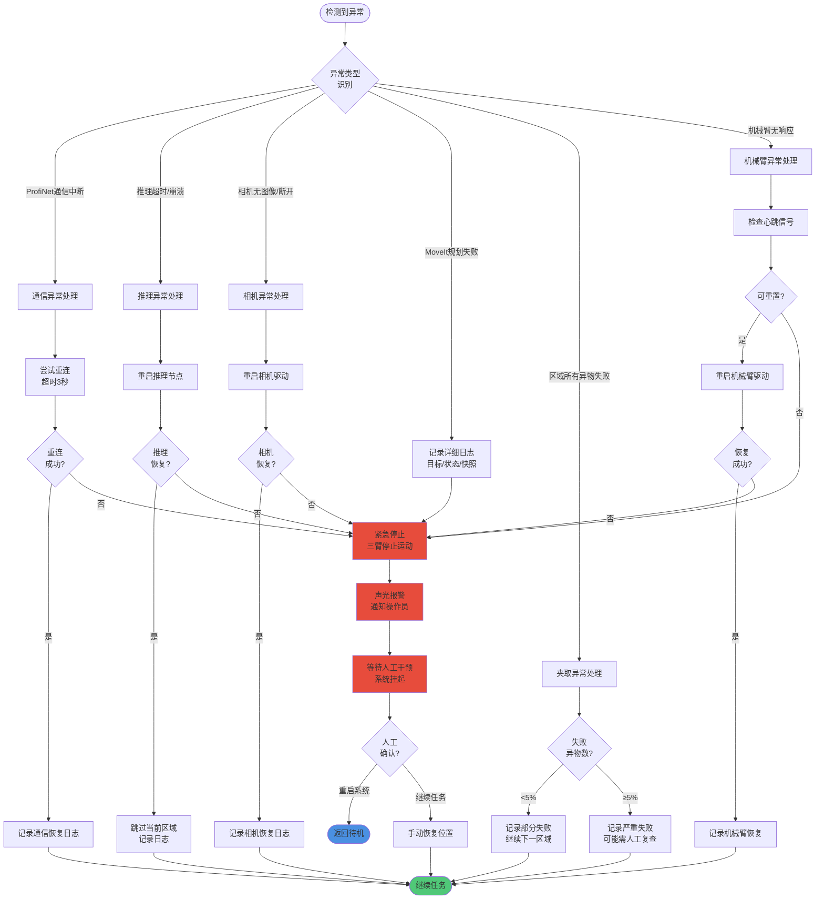

# 燕窝挑毛系统工作流程图

---

## 1. 系统整体工作流程

```mermaid
flowchart TD
    Start([系统启动]) --> Init[初始化系统<br/>加载配置/标定参数/三臂归零]
    Init --> Idle[待机状态<br/>等待启动信号]
    
    Idle -->|人工启动| Localize[托盘定位<br/>视觉臂扫描边缘<br/>计算偏差并修正]
    
    Localize --> Planning[区域规划<br/>划分20-30个3×3cm区域<br/>重叠5mm/固定顺序]
    
    Planning --> LoopStart{遍历所有区域}
    
    LoopStart -->|有待处理区域| ProcessRegion[处理单个区域<br/>见详细流程图2]
    
    ProcessRegion --> CheckRegionStatus{区域处理<br/>结果?}
    
    CheckRegionStatus -->|成功/部分失败| LogRegion[记录区域数据<br/>异物数量/成功失败统计]
    CheckRegionStatus -->|严重异常| HandleError[异常处理<br/>见异常处理流程图6]
    
    LogRegion --> LoopStart
    HandleError --> ErrorDecision{异常<br/>类型?}
    
    ErrorDecision -->|可恢复| LoopStart
    ErrorDecision -->|需干预| WaitIntervention[等待人工干预<br/>系统暂停]
    
    WaitIntervention -->|恢复| LoopStart
    
    LoopStart -->|全部完成| SaveData[汇总托盘数据<br/>保存日志/存入数据库<br/>统计处理时间]
    
    SaveData --> Signal[发出完成信号<br/>通知工人取走托盘]
    
    Signal --> Idle
    
    style Start fill:#4A90E2
    style Idle fill:#50C878
    style Signal fill:#9B59B6
    style ProcessRegion fill:#F39C12
    style HandleError fill:#E74C3C
    style WaitIntervention fill:#E74C3C
```

---

## 2. 单区域处理详细流程

```mermaid
flowchart TD
    Start([开始处理区域N]) --> Press[压板臂动作<br/>MoveIt规划路径<br/>移动到区域上方<br/>网格压板下压固定]
    
    Press --> VisionMove[视觉臂动作<br/>移动到区域上方<br/>工作距离15-20cm]
    
    VisionMove --> Capture[触发拍照<br/>静态图像采集]
    
    Capture --> Inference[视觉推理，异物位置识别]
    
    Inference --> CheckObjects{检测到<br/>异物?}
    
    CheckObjects -->|是| PickLoop[循环处理异物列表<br/>见子流程]
    CheckObjects -->|否| FinalCheck
    
    PickLoop --> PickOne[选择下一个异物] --> Coarse[夹爪粗定位<br/>MoveIt规划到异物附近<br/>误差约±1-2mm]
    
    Coarse --> IBVS[IBVS精密伺服<br/>ViSP闭环控制<br/>30-60Hz实时反馈<br/>检测夹爪标记+异物位置]
    
    IBVS --> IBVSCheck{误差<br/><0.1mm?}
    IBVSCheck -->|否/超时| IBVSRetry{IBVS重试<br/><3次?}
    IBVSRetry -->|是| IBVS
    IBVSRetry -->|否| LogFail1[记录失败日志<br/>该异物无法对准]
    LogFail1 --> MoreObjects1{还有<br/>其他异物?}
    
    IBVSCheck -->|是| Grip[夹爪闭合<br/>检测夹取力]
    
    Grip --> GripCheck{夹取<br/>成功?}
    GripCheck -->|否| GripRetry{夹取重试<br/><3次?}
    GripRetry -->|是| Grip
    GripRetry -->|否| LogFail2[记录失败日志<br/>该异物无法夹取]
    LogFail2 --> MoreObjects2{还有<br/>其他异物?}
    
    GripCheck -->|是| Clean[清洗/吸走<br/>移动到水槽处理<br/>其他两臂等待]
    
    Clean --> ReturnWork[返回工作区<br/>准备处理下一个]
    
    ReturnWork --> MoreObjects3{还有<br/>其他异物?}
    
    MoreObjects1 -->|是| PickOne
    MoreObjects2 -->|是| PickOne
    MoreObjects3 -->|是| PickOne
    
    MoreObjects1 -->|否| FinalCheck
    MoreObjects2 -->|否| FinalCheck
    MoreObjects3 -->|否| FinalCheck
    
    FinalCheck[质量检查<br/>视觉臂重新拍照<br/>算法检测验证]
    
    FinalCheck --> FinalResult{确认<br/>无异物?}
    
    FinalResult -->|否| PickLoop
    FinalResult -->|是| PressUp[压板抬起<br/>移动到下一区域]
    
    PressUp --> End([区域完成])
    
    style Start fill:#4A90E2
    style End fill:#50C878
    style LogFail1 fill:#E74C3C
    style LogFail2 fill:#E74C3C
    style IBVS fill:#F39C12
    style Grip fill:#9B59B6
```

---

## 3. IBVS视觉伺服核心算法流程

```mermaid
flowchart LR
    Start([IBVS开始]) --> Init[初始化<br/>目标: s* = 图像中心<br/>增益: λ = 0.5]
    
    Init --> Loop{伺服循环<br/>30-60Hz}
    
    Loop --> Capture[相机实时拍照]
    
    Capture --> DetectMarker[检测夹爪标记<br/>颜色分割+区域提取<br/>反推爪头位置]
    
    DetectMarker --> DetectObject[检测异物位置<br/>深度学习/模板匹配<br/>提取中心像素坐标]
    
    DetectObject --> CalcError[计算图像误差<br/>e = s - s*<br/>s: 异物当前坐标<br/>s*: 目标坐标]
    
    CalcError --> CheckConverge{误差<br/><阈值?}
    
    CheckConverge -->|是| Success([伺服成功<br/>进入夹取])
    
    CheckConverge -->|否| CheckTimeout{超时/<br/>最大迭代?}
    
    CheckTimeout -->|是| Fail([伺服失败<br/>重试机制])
    
    CheckTimeout -->|否| CalcJacobian[计算图像雅可比<br/>L = ∂s/∂v]
    
    CalcJacobian --> CalcVel[计算末端速度<br/>Δv = -λ·L⁺·e<br/>L⁺: 雅可比伪逆]
    
    CalcVel --> SendCmd[发送速度指令<br/>到机械臂驱动]
    
    SendCmd --> Loop
    
    style Start fill:#4A90E2
    style Success fill:#50C878
    style Fail fill:#E74C3C
    style Loop fill:#F39C12
```

---

## 4. 三臂协同时序图

```mermaid
sequenceDiagram
    participant TC as 任务协调器
    participant PA as 压板臂控制器
    participant VA as 视觉臂控制器
    participant GA as 夹爪臂控制器
    participant DL as 图像处理节点
    
    Note over TC: 开始处理区域N
    
    TC->>PA: 发送压板指令
    activate PA
    PA-->>PA: MoveIt规划路径
    PA-->>PA: 移动+下压
    PA->>TC: 状态: PRESSED
    deactivate PA
    
    TC->>VA: 发送拍照指令
    activate VA
    VA-->>VA: 移动到上方
    VA-->>VA: 触发拍照
    VA->>DL: 图像数据
    activate DL
    DL-->>DL: 推理检测
    DL->>VA: 异物列表[obj1, obj2, ...]
    deactivate DL
    VA->>TC: 检测结果
    deactivate VA
    
    loop 遍历异物列表
        TC->>GA: 发送夹取指令(obj_i)
        activate GA
        GA-->>GA: MoveIt粗定位
        GA-->>GA: IBVS精密伺服
        GA-->>GA: 夹取动作
        GA-->>GA: 移动到水槽
        Note over PA,VA: 其他臂等待
        GA-->>GA: 清洗/吸走
        GA-->>GA: 返回工作区
        GA->>TC: 状态: COMPLETED
        deactivate GA
    end
    
    TC->>VA: 质量检查指令
    activate VA
    VA-->>VA: 重新拍照
    VA->>DL: 图像数据
    activate DL
    DL-->>DL: 验证检测
    DL->>VA: 无异物检测
    deactivate DL
    VA->>TC: 检查通过
    deactivate VA
    
    TC->>PA: 压板抬起指令
    activate PA
    PA-->>PA: 抬起+移动下一区域
    PA->>TC: 状态: READY
    deactivate PA
    
    Note over TC: 区域N完成
```

---

## 5. 系统状态机图

```mermaid
stateDiagram-v2
    [*] --> IDLE: 系统启动
    
    IDLE --> LOCALIZING: 接收启动信号
    
    LOCALIZING --> PLANNING: 定位完成
    
    PLANNING --> PROCESSING: 规划完成
    
    PROCESSING --> PROCESSING: 处理下一区域
    PROCESSING --> COMPLETED: 全部区域完成
    PROCESSING --> ERROR: 严重异常
    
    COMPLETED --> IDLE: 发信号/重置
    
    ERROR --> IDLE: 人工干预/恢复
    ERROR --> PROCESSING: 自动恢复
    
    state PROCESSING {
        [*] --> PRESSING
        PRESSING --> DETECTING: 压板就位
        DETECTING --> PICKING: 检测到异物
        DETECTING --> VERIFYING: 未检测到异物
        PICKING --> PICKING: 处理下一异物
        PICKING --> VERIFYING: 全部异物处理完
        VERIFYING --> [*]: 验证通过
        VERIFYING --> PICKING: 验证未通过
    }
```

---

## 6. 异常处理详细流程

```mermaid
flowchart TD
    Start([检测到异常]) --> ClassifyError{异常类型<br/>识别}
    
    %% 通信异常
    ClassifyError -->|ProfiNet通信中断| CommError[通信异常处理]
    CommError --> TryReconnect[尝试重连<br/>超时3秒]
    TryReconnect --> CheckReconnect{重连<br/>成功?}
    CheckReconnect -->|是| LogComm[记录通信恢复日志]
    CheckReconnect -->|否| EmergencyStop[紧急停止<br/>三臂停止运动]
    LogComm --> Continue([继续任务])
    
    %% 深度学习推理异常
    ClassifyError -->|推理超时/崩溃| InferenceError[推理异常处理]
    InferenceError --> RestartInference[重启推理节点]
    RestartInference --> CheckInference{推理<br/>恢复?}
    CheckInference -->|是| SkipRegion[跳过当前区域<br/>记录日志]
    CheckInference -->|否| EmergencyStop
    SkipRegion --> Continue
    
    %% 相机异常
    ClassifyError -->|相机无图像/断开| CameraError[相机异常处理]
    CameraError --> RestartCamera[重启相机驱动]
    RestartCamera --> CheckCamera{相机<br/>恢复?}
    CheckCamera -->|是| LogCamera[记录相机恢复日志]
    CheckCamera -->|否| EmergencyStop
    LogCamera --> Continue
    
    %% MoveIt规划失败（离线验证已确保所有轨迹可规划，运行时失败说明出现意外情况）
    ClassifyError -->|MoveIt规划失败| PlanningError[记录详细日志<br/>目标/状态/快照]
    PlanningError --> EmergencyStop
    
    %% 夹取连续失败
    ClassifyError -->|区域所有异物失败| GripFailure[夹取异常处理]
    GripFailure --> CheckFailCount{失败<br/>异物数?}
    CheckFailCount -->|<5%| LogMinorFail[记录部分失败<br/>继续下一区域]
    CheckFailCount -->|≥5%| LogMajorFail[记录严重失败<br/>可能需人工复查]
    LogMinorFail --> Continue
    LogMajorFail --> Continue
    
    %% 压板/视觉臂卡死
    ClassifyError -->|机械臂无响应| ArmStuck[机械臂异常处理]
    ArmStuck --> CheckHeartbeat[检查心跳信号]
    CheckHeartbeat --> ResetArm{可重置?}
    ResetArm -->|是| RebootArm[重启机械臂驱动]
    ResetArm -->|否| EmergencyStop
    RebootArm --> CheckArmRecover{恢复<br/>成功?}
    CheckArmRecover -->|是| LogArmRecover[记录机械臂恢复]
    CheckArmRecover -->|否| EmergencyStop
    LogArmRecover --> Continue
    
    %% 紧急停止处理
    EmergencyStop --> AlertOperator[声光报警<br/>通知操作员]
    AlertOperator --> WaitManual[等待人工干预<br/>系统挂起]
    WaitManual --> ManualCheck{人工<br/>确认?}
    ManualCheck -->|重启系统| Restart([返回待机])
    ManualCheck -->|继续任务| ManualResume[手动恢复位置]
    ManualResume --> Continue
    
    style EmergencyStop fill:#E74C3C
    style AlertOperator fill:#E74C3C
    style WaitManual fill:#E74C3C
    style Continue fill:#50C878
    style Restart fill:#4A90E2
```

---

